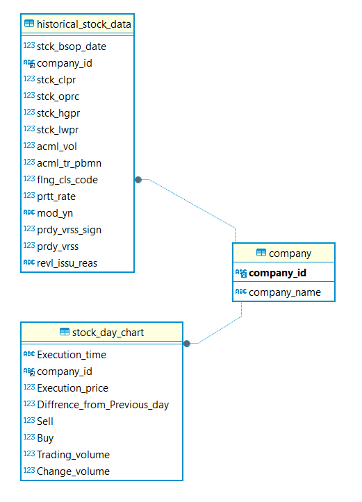

# 🚗Toy project🚗

## 1. 👥팀 소개
### 팀명 : Moneyweaver 팀
### 팀원 소개
<table align="center">
  <tbody>
    <tr>
      <td align="center">
        

          
           <a href="https://github.com/artemIntellectus">
팀장 유혜린
</a>
        

      </td>
      <td align="center">
        

          
          <a href="https://github.com/jeehun98">
김성은
</a>
        

      </td>
      <td align="center">
        

          
          <a href="https://github.com/5-lee">
구나연
</a>
        

      </td>
      <td align="center">
        

          
            <a href="https://github.com/{깃헙주소}">
정재현
</a>
        

      </td>
    </tr>
  </tbody>
</table>

  
### 팀원별 역할 소개
| 유혜린 (팀장) | 김성은님 | 구나연님 | 정재현님 | 
|:----------:|:----------:|:----------:|:----------:|
|데이터베이스 관리, AWS 기반 인프라 구축 및 관리, 배포 및 모니터링|데이터 수집, 전처리, 통합, 데이터베이스 관리, 프로젝트 도메인 조사|사용자 인터페이스 개발, 주식 데이터 시각화 구현|프로젝트 도메인 조사|
  
## 2. 💡프로젝트 소개
### 프로젝트 명 
<b>Stock Trading Program</b>
### 프로젝트 소개 
저희'Trandigo'는 제주도의 관광 데이터를 활용하여, 방문객의 목적, 연령대, 소비 패턴에 기반한 개인화된 관광 일정을 제공합니다. 우리의 목표는 관광객의 경험을 극대화하고, 제주도의 지역 경제를 활성화하는 것입니다. 이를 통해 관광객의 만족도를 높이며, 제주도의 관광 자원을 효율적으로 활용하여 지속 가능한 관광 산업 발전에 기여하고자 합니다.
### 프로젝트 내용 
#### 프로젝트 배경 
제주도는 한국의 주요 관광지로, 다양한 관광 자원과 아름다운 자연경관 덕분에 매년 많은 관광객이 방문합니다. 이 프로젝트는 제주도를 방문하는 내국인과 외국인 관광객의 행동 데이터를 분석하여 개인화된 관광 일정을 제공하고, 관광 트렌드를 파악함으로써 관광객 경험을 향상시키고 지역 경제를 활성화하는 것을 목표로 합니다. 데이터 분석을 통해 관광객의 소비 패턴과 선호도를 이해하고, 이를 바탕으로 효율적인 관광 마케팅과 맞춤형 서비스를 제공하여 제주도의 관광 산업에 기여하고자 합니다.
#### 프로젝트 도메인
제주도는 한국의 주요 관광지로, 다양한 관광 자원과 아름다운 자연경관 덕분에 매년 많은 관광객이 방문합니다. 이 프로젝트는 제주도를 방문하는 내국인과 외국인 관광객의 행동 데이터를 분석하여 개인화된 관광 일정을 제공하고, 관광 트렌드를 파악함으로써 관광객 경험을 향상시키고 지역 경제를 활성화하는 것을 목표로 합니다.
#### 프로젝트 목표 
- **📝관광객 패턴 분석📝**: 내국인 및 외국인 관광객의 관광 목적, 방문 형태, 그리고 소비패턴을 분석하여 관광객의 선호도를 파악하고 맞춤형 관광정보 제공

- **🪙경제 및 소비 트렌트 파악🪙**: 카드 결제 데이터를 활용해 연령별 및 업종별 소비 트렌드를 분석하고, 지역 경제의 동향을 이해하여 관광객들에게 더 나은 추천 서비스를 제공합니다.

- **🌴관광지 및 활동 분석🌴**: 여행 세부 일정 데이터를 통해 인기 관광지와 활동을 식별하고, 관광지의 매력도를 평가하여 관광 일정을 최적화합니다.
- **🌦️날씨와 관광패턴🌦️**: 기상 데이터를 분석하여 날씨에 따른 관광 패턴 변화를 예측하고, 관광 계획에 반영하여 관광객의 만족도를 관리합니다.
- **🚠교통 혼잡도 예측 및 최적화🚠**: 차량 교통량 데이터를 분석하여 도로별 혼잡도를 예측하고, 관광객의 이동을 효율적으로 관리합니다.
   

   

## 📒3. 1st Agile 진행사항
### 1st Agile 목표
본 프로젝트의 1차 목표는 증권회사의 API를 활용하여 주식 예측에 필요한 과거 데이터를 수집, 가공 및 데이터베이스 설계 후, 이를 Django 프레임워크와 연동하여 사용자에게 시각적으로 이해하기 쉬운 주식 데이터를 제공하는 웹 애플리케이션을 구축하는 것입니다.

#### 데이터 수집부분

1. **한국 투자증권 API** : 한국 투자증권에서 과거 주식 차트 데이터 들고오는 용도로 수집하였습니다. 
    > **투자시장의 경기를 판단하는 기간**
    - 단기 투자 시 필요한 기간 : 1년 ~ 3년
    - 중기 투자 시 필요한 기간 : 5년 ~ 7년
    - 장기 투자 시 필요한 기간 : 10년 이상

2. **RSI** : 주식 데이터를 분석하기 위해 RSI와 Stochastic RSI를 계산하는 Python 함수를 작성하였습니다. 
    > **활용방안**
    - 2차 애자일, 모델학습단계에서 활용할 예정
  
3. **naver 주식데이터** : 분당 주식 차트 정보를 수집하였습니다.

4. **크롤링 기업리스트**
    > **대규모 정보를 기반으로 AI에 투자하는 기업 (종목코드)**
    - 005930 삼성전자 
    - 035420 네이버
    - 003550 LG <- LG CNS
    - 034730 SK inc. <- sk 텔레콤, sk C&C 지주회사
    - 035720 카카오
    - 000660 SK 하이닉스
    - 030200 KT
    - 005380 현대자동차
    - 005490 포스코

#### 데이터 베이스부분 
직접작성
#### 사용자 화면 시각화
1. **메인화면 구현** : 사용자가 저희 서비스에 접속하면 처음 보게 되는 메인 페이지입니다. 메인 페이지에서는 우리의 서비스에 대한 간략한 설명을 제공하며, 하단에 네비게이션 바를 추가하여 사용자가 서브 페이지로 쉽게 이동할 수 있도록 구현하였습니다.

2. **chart-index page (서브페이지)** : 저희가 크롤링한 기업별 과거 주식 데이터를 확인할 수 있는 안내 페이지를 구현하였습니다. 이 페이지에서는 각 기업의 주식 정보를 쉽게 조회할 수 있도록 안내하고 있습니다.

3. **chart-graph page(그래프)** : 해당 기업의 주식 데이터를 차트로 시각화하여 사용자들이 데이터를 쉽게 파악할 수 있도록 화면을 구성하였습니다.
#### aws RDS 생성 및 배포부분
직접작성

 

## 4. 📱기술 스텍
| Data Modeling | DB | Front-End |   Back-End   | Deployment
|------------|--------|-------------|------------|----------|
|     |   |    | |

   

## 5. 🧸요구사항 명세서
요구사항 명세서는 프로젝트의 기능을 중요도에 따라 구분하고, 세부적으로 구현해야 할 기능들을 우선순위에 따라 배치합니다. 이를 통해 프로젝트를 보다 효율적으로 진행할 수 있도록 설계되었습니다. 저희 <b>Trandigo</b>는 이러한 방식으로 기능별 우선순위를 매겨 프로젝트를 보다 체계적으로 관리할 수 있었습니다.
 

- 요구사항 ID : 요구사항별로 유일한 ID를 부여하여 기입합니다. 저희는 프로젝트의 포괄적인 기능 별로 ID를 정의하였습니다. 

- 기능구분 : 도출된 요구사항을 간략하게 요약하여 기입하였습니다. 

- 중요도 : 해당 요구사항의 전체 시스템 구현 측면에서의 중요도를 기술하였습니다. (상, 중, 하) 
- 요구사항 상세 설명 : 기능이름에 더하여 부가적으로 기능을 구체적으로 기술하였습니다. 

   

## 6. 📜ERD 설계서
Trandigo 프로젝트의 ERD(Entity-Relationship Diagram) 설계서는 제주도 관광 데이터 분석 시스템의 데이터 구조를 시각적으로 표현한 다이어그램입니다.  이 설계서는 다양한 관광 관련 데이터를 효율적으로 관리하고 분석하기 위해, 각 데이터 간의 관계와 구조를 명확하게 정의합니다.   ERD 설계를 통해 관광객의 방문 목적, 연령대, 소비 패턴 등 복잡한 데이터를 체계적으로 관리하고, 이를 기반으로 추가적인 기능도 구현할 수 있습니다.  

 

   

## 📚7. Architecture

   

##  💻8. 프로젝트 결과 
1. main page

 
2. index page

   

## 🤔9. 오류 및 어려웠던점 & 해결 과정
### 데이터 수집 및 분석부분
- **설명**: 제주 여행 트랜드 분석에 사용될 수 있는 데이터들의 수집,  알맞은 형태로 전처리 후 저장
- **문제**: 수집된 데이터들이 서로 다른 형식들을 띄고있었기 때문에 데이터가 통합이 되지않았음.
- **해결**: 다양한 전처리 방식의 사용, 지역명, 날짜 표시 방식의 통일 등의 방법으로 이를 해결할 수 있었음

### 데이터베이스 설계 및 적재부분
- **설명**: 설계된 erd를 바탕으로 mysql에 수집된 데이터들을 적재하는 과정
- **문제**: 수집된 데이터의 형태와 데이터의 내용이 달라 erd기반으로 데이터베이스에 적재하는과정에서 DB 제약조건에 위반됨.
- **해결**: 수집된 데이터에서 중복된 컬럼과 조합을 그룹으로 묶어 지우고 전처리하여 데이터를 성공적으로 적재할 수 있었음

### 화면 구성 부분 및 데이터 시각화부분
1. <b>차트데이터 필터링문제</b>
- **설명**: Djnago view 파일과 Templates Html파일 작업, Javascript 코드를 사용해서 Apexcharts 표현해 시각화
- **문제**: 지역명을 선택하면 그 지역명으로 고정되는것이 아닌 제주시 추자면으로 돌아옴
- **해결**: POST 요청 시, 사용자가 선택한 지역명을 기반으로 데이터를 처리하도록 코드를 수정했습니다. 구체적으로, Django view 파일에서 POST 요청을 받을 때, 전달된 지역명을 세션에 저장하거나 컨텍스트에 포함시켜 이후 데이터 필터링에 반영
2. <b>차트 데이터 동기화 및 시각적 구성</b>
- **설명**: 차트에 표시되는 데이터의 정확성과 일관성을 유지하기 위해, 백엔드와 프론트엔드 간의 데이터 동기화 작업
- **문제**: 기존 차트를 파괴하고 새로 생성하는 과정에서 destroy 메서드와 관련된 오류가 발생
- **해결**: 차트 파괴 및 재생성 로직을 개선.
3. <b>UI구성 및 레이아웃 조정</b>
- **설명**: CSS를 활용하여 전반적인 스타일링 개선 및 레이아웃을 조정
- **문제**: CSS 스타일링과 레이아웃 조정에서 차트와 테이블 간의 간격, 텍스트 정렬, 배경색, 반응형 디자인 적용에 어려움이 있었음.
- **해결**: 요소 간의 균형을 맞추기 위해 마진, 패딩, 텍스트 정렬 등을 조정했고, 미디어 쿼리를 활용해 다양한 화면 크기에 대응할 수 있도록 했음. 일관된 색상과 폰트 스타일을 적용해 가독성을 향상시키고자 하였음.

### aws 배포 부분
- **설명**: aws RDS 구축 및 ec2서버 배포
- **문제**: 라인 엔딩 문제 발생 / aws RDS 사용 시 사용자 계정 생성 문제 / 경설정이 다양해서 에러 발생 시 정확한 원인 찾기가 어려움
- **해결**: 라인 엔딩 문제 : 스크립트 형식을 Unix 형식의 라인 엔딩(LF)으로 변경하여 해결 / 사용자 계정 생성 : admin 계정에서 user 중 root 사용자 생성하니 admin에게 부여 권한 생겼고, 이후 사용자에게 권한 부여하여 사용자 계정으로 DB 적재 완료 / 정확한 에러 원인 파악 : 에러 경로를 파악하기 용이하도록 django, gunicorn, nginx, docker, run파일 설정이 정확한 경로로 설정하여 해결하였다.
   

