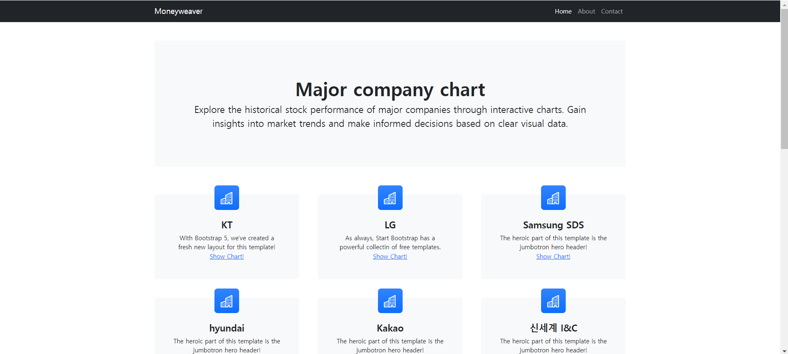

# 🚗Toy project🚗

## 👥1. 팀 소개
### 팀명 : Moneyweaver 팀
### 팀원 소개
<table align="center">
  <tbody>
    <tr>
      <td align="center">
        <div>
          
           <a href="https://github.com/artemIntellectus"><div align=center>팀장 유혜린</div></a>
        </div>
      </td>
      <td align="center">
        <div>
          
          <a href="https://github.com/jeehun98"><div align=center>김성은</div></a>
        </div>
      </td>
      <td align="center">
        <div>
          
          <a href="https://github.com/5-lee"><div align=center>구나연</div></a>
        </div>
      </td>
      <td align="center">
        <div>
          
            <a href="https://github.com/{깃헙주소}"><div align=center>정재현</div></a>
        </div>
      </td>
      <td align="center">
        <div>
          
            <a href="https://github.com/{깃헙주소}"><div align=center>송명신</div></a>
        </div>
      </td>
    </tr>
  </tbody>
</table>

<br><br>
### 팀원별 역할 소개
| 유혜린👑 | 김성은님 | 구나연님 | 정재현님 | 송명신님 |
|:----------:|:----------:|:----------:|:----------:|:----------:|
|데이터베이스 관리, AWS 기반 인프라 구축 및 관리, 배포 및 모니터링|데이터 수집, 전처리, 통합, 데이터베이스 관리, 전체 아키텍처 설정|사용자 인터페이스 개발, 주식 데이터 시각화 구현, readme작성|프로젝트 도메인 조사| ✨new member!✨|
<br><br>
## 💡2. 프로젝트 소개
### 프로젝트 명 
<b>💰Stock Trading Program💰</b>
### 프로젝트 소개 
본 프로젝트는 실시간 주식 데이터를 분석하고, 실시간 뉴스 기사를 기반해 주식 거래를 자동화하는 주식 트레이딩 프로그램입니다. 
우리가 개발할 트레이딩 프로그램은 단순히 주식 데이터를 수집하고 분석하는 것을 넘어, 실시간으로 변화하는 시장 상황에 맞춰 자동으로 거래를 실행하는 것을 목표로 합니다.
### 프로젝트 내용 
#### 프로젝트 도메인
저희 프로젝트의 최종 목표는 RSI(Relative Strength Index)를 활용하여 주식 자동매매 프로그램을 개발하는 것입니다. 이를 위해 다음과 같은 기본 도메인 개념을 설명하겠습니다.<br>
- **RSI** : 식의 과매수 또는 과매도 상태를 판단하기 위한 기술적 지표로, 특정 기간 동안의 평균 상승과 하락 폭을 비교하여 주식의 가격 추세를 분석합니다.
    - RSI 70이상 : 과매수 상태로 가격이 지나치게 상승했음
    - RSI 30이하 : 과매도 상태로 가격이 지나치게 하락
- **RSI 다이버전스** : RSI 다이버전스는 RSI 보조 지표와 주가가 서로 반대 방향으로 움직이는 현상
    - ex: 주가가 상승하는데 보조 지표는 하락하거나 주가가 하락하는데 보조 지표는 상승하는 현상

- **매수 및 매도 매커니즘** <br>
  1. 📈상승을 암시하는 다이버전스
      - **첫 번째 꼭짓점 설정** : RSI가 충분히 낮아진 지점을 첫 번째 꼭짓점으로 설정
      - **두 번째 꼭짓점 설정** : 첫 번째 꼭짓점보다 주가가 낮아졌으나 RSI는 높아지면서 반등 기미를 보이는 지점을 두 번째 꼭짓점으로 설정
      - **매수 시점** : 두 번째 꼭짓점이 형성된 후 즉시 매수

  2. 📉하락을 암시하는 다이버전스
      - **첫 번째 꼭짓점 설정** : RSI가 충분히 높아진 지점을 첫 번째 꼭짓점으로 설정
      - **두 번째 꼭짓점 설정** : 첫 번째 꼭짓점보다 주가가 높아졌으나 RSI는 낮아지면서 하락 기미를 보이는 지점을 두 번째 꼭짓점으로 설정
      - **매도 시점** : 두 번째 꼭짓점이 형성된 후 즉시 매도

#### 1st Agile과 도메인
1. **historical_stock_data** 테이블 설명
테이블 이름: **historical_stock_data**
  * **stck_bsop_date**: 거래 일자. 주식 거래가 발생한 날짜를 의미합니다.
  * **company_id**: 회사 ID. 특정 회사를 식별하는 고유 식별자입니다.
  * **stck_clpr**: 종가(Close Price). 하루 거래가 종료될 때의 주가입니다.
  * **stck_oprc**: 시가(Open Price). 거래가 시작될 때의 주가입니다.
  * **stck_hgpr**: 최고가(High Price). 하루 중 가장 높았던 주가입니다.
  * **stck_lwpr**: 최저가(Low Price). 하루 중 가장 낮았던 주가입니다.
  * **acml_vol**: 누적 거래량(Accumulated Volume). 하루 동안 거래된 총 주식 수를 나타냅니다.
  * **acml_tr_pbmn**: 누적 거래 대금(Accumulated Trading Value). 하루 동안 거래된 총 금액입니다.

2. 도메인 연결 및 RSI 매커니즘에서의 역할
RSI 계산에 필요한 데이터

* **stck_clpr (종가)**: RSI 계산의 기본이 되는 데이터입니다. 일정 기간 동안의 종가 변동을 바탕으로 RSI가 계산됩니다. 종가를 이용해 주가의 상승/하락의 강도를 계산한 뒤, 이를 평균으로 계산하여 RSI를 도출합니다.
    - **모델 학습**
    위에서 수집한 일간 주가와 계산한 RSI를 사용하여 모델을 학습시킵니다. 이 모델은 다음 날의 주가와 RSI를 예측하는 데 사용됩니다.

    - **다이버전스 포착**
    예측한 주가와 RSI 사이의 다이버전스를 분석합니다. 예를 들어, 주가가 하락할 것으로 예측되지만 RSI가 상승할 것으로 예측된다면, 이는 매수 신호로 해석합니다.

    - **매매 실행**
    다음 날 아침 9시 장이 열리는 시점에 매매가 이루어집니다. 자동매매 프로그램은 키움증권의 API와 연동되어 있어 신호에 따라 자동으로 매매를 실행합니다.


#### 프로젝트 목표 
- **실시간 주식 데이터 분석 및 자동화된 거래 시스템 구축** : 실시간으로 변동하는 주식 데이터를 수집하고 분석하여, 사용자가 설정한 트레이딩 전략에 따라 자동으로 매수, 매도를 실행할 수 있는 시스템을 개발합니다.
- **뉴스 기반 시장 예측 및 대응** : 실시간 뉴스 기사를 분석하여 시장에 영향을 미칠 수 있는 중요한 이벤트를 감지하고, 이를 기반으로 주식 거래 전략을 자동으로 조정하여 시장 변화에 빠르게 대응 시스템 개발합니다.


<br><br><br>

## 📒3. 1st Agile 진행사항
### 1st Agile 목표
본 프로젝트의 1차 목표는 증권회사의 API를 활용하여 주식 예측에 필요한 과거 데이터를 수집, 가공 및 데이터베이스 설계 후, 이를 Django 프레임워크와 연동하여 사용자에게 시각적으로 이해하기 쉬운 주식 데이터를 제공하는 웹 애플리케이션을 구축하는 것입니다.

#### 데이터 수집부분

1. **한국 투자증권 API** : 한국 투자증권에서 과거 주식 차트 데이터 들고오는 용도로 수집하였습니다.<br>
    > 📆**투자시장의 경기를 판단하는 기간**📆
    - 단기 투자 시 필요한 기간 : 1년 ~ 3년
    - 중기 투자 시 필요한 기간 : 5년 ~ 7년
    - 장기 투자 시 필요한 기간 : 10년 이상

2. **RSI** : 주식 데이터를 분석하기 위해 RSI와 Stochastic RSI를 계산하는 Python 함수를 작성하였습니다.<br>
    > 📉**활용방안**📈
    - 2차 애자일, 모델학습단계에서 활용할 예정
  
3. **naver 주식데이터** : 분당 주식 차트 정보를 수집하였습니다.

4. **크롤링 기업리스트**
    > 🏢<b>대규모 정보를 기반으로 AI에 투자하는 기업 (종목코드)</b>🏢
    - 005930 삼성전자 
    - 035420 네이버
    - 003550 LG <- LG CNS
    - 034730 SK inc. <- sk 텔레콤, sk C&C 지주회사
    - 035720 카카오
    - 000660 SK 하이닉스
    - 030200 KT
    - 005380 현대자동차
    - 005490 포스코


#### 사용자 화면 시각화
1. **메인화면 구현** 
    > 📝**html/css/js**이용📝
    - 사용자가 저희 서비스에 접속하면 처음 보게 되는 메인 페이지입니다. 메인 페이지에서는 우리의 서비스에 대한 간략한 설명을 제공하며, 하단에 네비게이션 바를 추가하여 사용자가 서브 페이지로 쉽게 이동할 수 있도록 구현하였습니다.

2. **chart-index page (서브페이지)** : 저희가 크롤링한 기업별 과거 주식 데이터를 확인할 수 있는 안내 페이지를 구현하였습니다. 이 페이지에서는 각 기업의 주식 정보를 쉽게 조회할 수 있도록 안내하고 있습니다.

3. **chart-graph page(그래프)** 
    > 📈**apaxchart**📈
    - 해당 기업의 주식 데이터를 차트로 시각화하여 사용자들이 데이터를 쉽게 파악할 수 있도록 화면을 구성하였습니다.


#### AWS RDS 생성 및 배포부분

- **AWS RDS에서 MySQL 데이터베이스 생성**
  1. AWS Management Console에 로그인
  2. RDS 서비스로 이동
  3. 데이터베이스 생성
  4. DB 인스턴스 설정
      * DB 인스턴스 식별자: 데이터베이스를 식별할 수 있는 고유한 이름을 입력합니다.
      * 마스터 사용자 이름 및 암호: 데이터베이스에 대한 관리자 사용자 이름과 암호를 설정합니다. 이 정보는 DB_USER 및 DB_PASSWORD로 사용됩니다.
  5. DB 인스턴스 사양 설정
      * 필요에 따라 인스턴스 클래스, 스토리지, 가용성 및 성능 옵션을 설정합니다. 
  6. VPC 및 보안 설정
  7. DB 인스턴스 생성


- **DB 연결**

생성된 MySQL DB 인스턴스에 연결하기 위해 .env 파일 사용

<br>

## 📱4. 기술 스텍
| Data Modeling | DB | Front-End |   Back-End   | Deployment
|------------|--------|-------------|------------|----------|
|     |   |    | |

<br><br><br>

## 📜5. ERD 설계서
Moneyweaver 프로젝트의 ERD(Entity-Relationship Diagram) 설계서는 주식 자동매매 프로그램의 데이터 구조를 시각적으로 표현한 다이어그램입니다.<br> 이 설계서는 주식 거래 데이터, 기술적 지표, 자동매매 알고리즘 등 다양한 주식 관련 데이터를 효율적으로 관리하고 분석하기 위해, 각 데이터 간의 관계와 구조를 명확하게 정의합니다.<br> ERD 설계를 통해 주식의 과매수 및 과매도 상태, 거래 신호 생성, 매매 기록 등 복잡한 데이터를 체계적으로 관리하고, 이를 기반으로 주식 자동매매 시스템의 기능을 구현할 수 있습니다.<br>

<br>


<br><br><br>


## 📚6. Architecture


<br><br><br>


##  💻7. 프로젝트 결과 
1. main page


2. index page


3. chart page


<br><br><br>


## 🤔8. 1st Agile Memo
### 혜린✏️
- **느낀점** : 제가 알고 있는 것과 실제로 해봤을 때가 달라 혼란스러웠습니다. 어떻게 하는지 몰라서 강사님의 자료를 찾아서 따라하다보니 어느새 저는 강사님 docker부터 aws까지 처음부터 다시 다 돌려본 사람이 되었습니다. 이제는 이해하고 있는데 약간.... 뭐랄까....좀 더 aws가 앞에 있었다면 빨리 끝낼 수 있지 않았을까.. 하는 아쉬움이 있지만!! 복습도 되고 좋은 경험이었습니다.

### 성은✏️
- **특이사항 존재**: Naver Requests 사용 조건 및 데이터 추출 과정에서 특이한 조건을 발견했습니다. 
  1. 주소창에서 소스 코드 확인: 주소창에서 view-source:를 입력해서 소스가 불러와져야 합니다.
  2. html의 태그를 쫓아서 내가 찾고싶은 데이터를 호출하는 주소를 찾아야했는데, 이 단계에서 내가 찾고자 하는 데이터가 어디에서 불러와지는지 명확히 파악이 가능하였습니다.
  3. html이 아니거나 태그가 없는 경우는 보통 숨겨져있다는 사실을 알았고 숨겨진 경우는 2가지로 분류할 수 있습니다.
      - 쿼리로 숨겨져 있는 경우 : 이 경우에는 쿼리 패턴을 찾아 태그를 찾아내는 방법이 있습니다.
      - 호출 주소로 숨겨져 있는 경우엔, 페이지에서 바로가기 주소를 확인하면 됩니다.
  4.  이 과정을 리소스를 불러오는 위치까지 무한 반복합니다.
  5. 마지막 리소스 페이지에서 원하는 정보를 추출합니다.<br>

- **느낀점** : 이번 작업을 통해 웹에서 원하는 데이터를 수집하기 위해서는 철저한 분석과 반복적인 탐색이 필수적임을 다시 한번 깨달았습니다. 또한, 데이터가 숨겨져 있거나 복잡하게 구조화되어 있을 경우에도 이를 풀어내는 능력을 키울 수 있는 유익한 경험이었습니다.  

### 나연✏️
- **문제점 발생** : 데이터베이스와의 연동 과정에서 company_id별로 데이터를 필터링할 때 문제가 발생했습니다. 이로 인해 필터링된 데이터가 템플릿에 제대로 전달되지 않았고, 결과적으로 빈 차트가 화면에 출력되었습니다.
- **해결 방법**: 문제 해결을 위해, 먼저 historical_stck_data 테이블의 각 컬럼 데이터 타입을 확인했습니다. 이후, 차트에 사용되는 컬럼들의 데이터 타입에 맞게 필터링 조건을 수정하였습니다. 데이터를 올바르게 필터링한 결과, 차트에 의도한 대로 데이터가 잘 표시되었습니다.
- **느낀점** : 이번 경험을 통해 데이터베이스와의 연동 시, 필터링 조건과 데이터 타입의 일치가 얼마나 중요한지를 다시 한번 깨달았습니다. 데이터 타입을 정확히 이해하고, 그에 맞게 필터링을 적용하는 것이 성공적인 데이터 시각화의 핵심임을 확인할 수 있었습니다.


### 재현✏️
- **느낀점** : 2차 애자일에서는 머신러닝과 딥러닝을 배운 것을 토대로 자동 매매 프로그램을 돌려보는 것이 목표이기 때문에 수업을 잘 듣고 복습을 열심히 해야겠다고 느꼈습니다.
<br><br><br>


## 📖9. 2nd Agile 주요계획
### RSI 계산 공식

1. **종가 변화량 계산**:
   - `delta = stck_clpr.diff()`
   - **stck_clpr**(Stock Closing Price): 일별 종가를 나타내는 컬럼

2. **상승폭 (Uptick)과 하락폭 (Downtick) 계산**:
   - **상승폭 (Gain)**: `gain = delta.where(delta > 0, 0)`
   - **하락폭 (Loss)**: `loss = -delta.where(delta < 0, 0)`

3. **Average Gain과 Average Loss 계산**:
   - **Average Gain**: `average_gain = gain.rolling(window=14, min_periods=1).mean()`
   - **Average Loss**: `average_loss = loss.rolling(window=14, min_periods=1).mean()`

4. **RS (Relative Strength) 계산**:


   $RS = \frac{\text{average gain}}{\text{average loss}}$

5. **RSI 계산**:

   $RSI = 100 - \frac{100}{1 + RS}$

### Python 코드 예제: Daily Stock Info 데이터로 RSI 계산

아래는 Daily Stock Info 데이터에서 **stck_clpr** 컬럼을 사용해 RSI를 계산하는 Python 코드 일부이다.

```python
import pandas as pd

# Daily Stock Info 데이터 로드 (예시 데이터프레임)
data = pd.DataFrame({
    'stck_bsop_date': ['20230101', '20230102', '20230103', '20230104', '20230105'],
    'stck_clpr': [100000, 102000, 101000, 103000, 105000]
})

# 기간 설정 (기본: 14일)
window_length = 14

# 종가 변화량 계산
delta = data['stck_clpr'].diff()

# 상승폭 (Uptick)과 하락폭 (Downtick) 계산
gain = delta.where(delta > 0, 0)
loss = -delta.where(delta < 0, 0)

# Average Gain과 Average Loss 계산
average_gain = gain.rolling(window=window_length, min_periods=1).mean()
average_loss = loss.rolling(window=window_length, min_periods=1).mean()

# RS (Relative Strength) 계산
rs = average_gain / average_loss

# RSI 계산
rsi = 100 - (100 / (1 + rs))

# 결과 출력
data['RSI'] = rsi
print(data[['stck_bsop_date', 'stck_clpr', 'RSI']])
```

### 코드 설명

1. **delta**: `stck_clpr.diff()`로 종가의 변화량을 계산
2. **gain**: `delta.where(delta > 0, 0)`을 통해 양수 변화만을 추출하여 상승폭을 계산
3. **loss**: `-delta.where(delta < 0, 0)`을 통해 음수 변화만을 추출하고, 이를 양수로 변환하여 하락폭을 계산
4. **average_gain**과 **average_loss**: `gain`과 `loss`의 14일 동안의 평균을 계산
5. **rs**: 평균 상승폭과 평균 하락폭의 비율을 계산
6. **rsi**: 최종적으로 RSI 지표를 계산하여 데이터프레임에 추가

이렇게 계산된 **RSI** 값을 사용해 주식이 과매수(70 이상) 또는 과매도(30 이하) 상태인지 판단가능 하고, 이를 통해 매매 시점을 결정하는 데 활용할 수 있다.


그리고, 최고가, 최저가, 거래량 등의 정보는 RSI 계산에서는 직접적으로 사용되지 않지만, 주식 분석 및 예측 모델에서는 매우 중요한 역할을 한다. 

### 1. **최고가 (High Price)와 최저가 (Low Price)**
- **변동성 분석**: 최고가와 최저가는 해당 일자의 주식 가격 변동성을 분석하는 데 사용
    - 변동성은 주식의 위험도와 불확실성을 나타내며, 이는 투자 결정을 내리는 데 중요한 지표
- **Bollinger Bands 계산**: Bollinger Bands는 주가의 변동성을 측정하는 지표
    - 최고가와 최저가를 활용하여 주가가 평균으로부터 얼마나 떨어져 있는지를 분석한다.
- **전략적 저항 및 지지선 분석**: 최고가와 최저가는 저항선(Resistance)과 지지선(Support)을 설정하는 데 사용
    - 주식이 특정 가격 수준을 돌파하거나 지지하는 시점은 중요한 매매 시그널로 작용할 수 있다.

### 2. **거래량 (Volume)**
- **거래량 지표**: 거래량은 주식의 유동성을 나타내며, 주가의 움직임에 대한 강도를 측정하는 데 사용된다. 
    - 높은 거래량과 함께 주가가 상승하면 상승 추세의 강도가 높다는 신호일 수 있습니다.
- **OBV(On-Balance Volume) 지표**: OBV는 거래량을 기반으로 한 모멘텀 지표로, 주가 변화와 거래량의 관계를 분석한다. 
    - 이는 주가의 향후 방향성을 예측하는 데 도움이 됩니다.
- **RSI와 거래량의 조합**: RSI 지표와 거래량을 함께 분석하면 더 강력한 매매 시그널을 포착할 수 있다. 
    - RSI가 과매수 상태에 있으나 거래량이 적다면 매수 신호가 약할 수 있습니다.

### 3. **예측 모델에서의 활용**
- **피처로 활용**: 최고가, 최저가, 거래량 등은 ARIMA나 XGBoost 모델에서 중요한 피처(feature)로 사용된다. 이러한 피처들은 모델이 미래의 주가를 예측하는 데 필요한 중요한 정보를 제공한다.
  - **XGBoost**: 이 모델은 다수의 피처를 활용하여 주가 예측을 수행하므로, 최고가, 최저가, 거래량, 종가 등의 정보를 모두 포함시켜 모델 성능을 향상시킬 수 있다.
  - **ARIMA**: ARIMA 모델은 시계열 데이터를 활용하여 예측을 수행하며, 종가와 함께 최고가, 최저가 등을 포함하여 모델을 확장할 수 있다.

### 종합적으로
최고가, 최저가, 거래량 등의 정보는 다음과 같이 활용될 수 있다.
- **변동성 및 추세 분석**: Bollinger Bands, 지지선/저항선 설정, 변동성 분석
- **거래량 기반 지표**: OBV, 거래량-모멘텀 분석
- **예측 모델 피처**: ARIMA와 XGBoost 모델에서 예측 피처로 활용

이 정보를 모두 활용하여 주식의 종합적인 분석과 예측 모델을 구축할 수 있다. 추가적으로, 이런 지표들을 통합적으로 분석하여 더 정교한 매매 전략을 세울 수 있다.


